# Block-diagram previews (mermaid)

Mirror of the two TikZ block diagrams in the slides, for visual iteration.
The TikZ versions use the same node names and same flow.

Conventions in both diagrams:

* **Blue** boxes — generic ops or linears (`nn.Linear` / reshape / identity).
* **Red** boxes — bilinear matmuls (receive the AlphaBeta LRP rule).
* **Green** boxes — normalisations or softmax (receive the identity rule).
* **Orange** circles — residual additions (ratio-rule split).
* The dashed box marks the substituted unfolded attention.

## Diagram A — Standard timm ViT block (TimmAttentionUnfolded)

```mermaid
flowchart LR
    classDef op fill:#cfe2ff,stroke:#0d6efd,stroke-width:1px
    classDef bilin fill:#f8d7da,stroke:#dc3545,stroke-width:1px
    classDef norm fill:#d1e7dd,stroke:#198754,stroke-width:1px
    classDef add fill:#fff3cd,stroke:#fd7e14,stroke-width:1px

    xin([tokens x ∈ R^&#123;BxNxD&#125;<br/>N=197 = 1 cls + 196 patch]):::op
    norm1[LayerNorm norm1]:::norm

    subgraph UAttn["TimmAttentionUnfolded (substituted in)"]
        direction LR
        qkv[qkv: Linear D→3D]:::op
        split[split + reshape<br/>→ &#40;B,H,N,d_h&#41;]:::op
        qnorm[q_norm]:::op
        knorm[k_norm]:::op
        vid[v_id<br/>Identity, hookable]:::op
        qid[q_id<br/>Identity, hookable]:::op
        kid[k_id<br/>Identity, hookable]:::op
        scaleq[scale_q ×&nbsp;d_h^&#123;-1/2&#125;]:::op
        qk[qk_scores = Q Kᵀ]:::bilin
        sm[softmax]:::norm
        ctx[context = attn V]:::bilin
        merge[reshape merge heads]:::op
        proj[proj: Linear D→D]:::op

        qkv --> split
        split -- Q --> qnorm --> qid --> scaleq --> qk
        split -- K --> knorm --> kid --> qk
        split -- V --> vid --> ctx
        qk --> sm --> ctx --> merge --> proj
    end

    add1((+)):::add
    norm2[LayerNorm norm2]:::norm
    fc1[mlp.fc1: D → 4D]:::op
    gelu[GELU]:::op
    fc2[mlp.fc2: 4D → D]:::op
    add2((+)):::add
    xout([output tokens]):::op

    xin --> norm1 --> qkv
    proj --> add1
    xin -. residual (ratio rule) .-> add1
    add1 --> norm2 --> fc1 --> gelu --> fc2 --> add2 --> xout
    add1 -. residual .-> add2
```

## Diagram B — Eva / DINOv3 block (EvaAttentionUnfolded)

```mermaid
flowchart LR
    classDef op fill:#cfe2ff,stroke:#0d6efd,stroke-width:1px
    classDef bilin fill:#f8d7da,stroke:#dc3545,stroke-width:1px
    classDef norm fill:#d1e7dd,stroke:#198754,stroke-width:1px
    classDef add fill:#fff3cd,stroke:#fd7e14,stroke-width:1px

    xin([tokens x ∈ R^&#123;BxNxD&#125;<br/>N=261 = cls + 4 reg + 256 patch]):::op
    norm1[norm1 LayerNorm]:::norm

    subgraph EvaAttn["EvaAttentionUnfolded (substituted in)"]
        direction LR
        qkv[qkv]:::op
        split[split<br/>ChunkAlongLastDim&#40;3&#41;]:::op
        qnorm[q_norm]:::op
        knorm[k_norm]:::op
        vid[v_id]:::op
        rq[rope_q]:::op
        rk[rope_k]:::op
        sq[scale_q]:::op
        qk[qk_scores = Q Kᵀ]:::bilin
        mask[add_mask]:::op
        sm[softmax]:::norm
        ctx[context = attn V]:::bilin
        rs[reshape]:::op
        n[norm post-attn LN]:::norm
        proj[proj]:::op

        qkv --> split
        split -- Q --> qnorm --> rq --> sq --> qk
        split -- K --> knorm --> rk --> qk
        split -- V --> vid --> ctx
        qk --> mask --> sm --> ctx --> rs --> n --> proj
    end

    ls1[ls1: γ₁·]:::op
    add1((+)):::add
    norm2[norm2]:::norm
    fc1[mlp.fc1]:::op
    gelu[GELU]:::op
    fc2[mlp.fc2]:::op
    ls2[ls2: γ₂·]:::op
    add2((+)):::add
    xout([output tokens]):::op

    xin --> norm1 --> qkv
    proj --> ls1 --> add1
    xin -. residual ratio rule .-> add1
    add1 --> norm2 --> fc1 --> gelu --> fc2 --> ls2 --> add2 --> xout
    add1 -. residual .-> add2
```

## Hookable submodule paths (recap)

| Path                                          | Shape          | Concept                |
|-----------------------------------------------|----------------|------------------------|
| `blocks.{i}.attn.qk_scores`                   | (B,H,N,N)      | — (rule target)        |
| `blocks.{i}.attn.softmax`                     | (B,H,N,N)      | —                      |
| `blocks.{i}.attn.context`                     | (B,H,N,d_h)    | **HeadConcept**        |
| `blocks.{i}.attn.rope_q` / `q_id`             | (B,H,N,d_h)    | **QConcept**           |
| `blocks.{i}.attn.rope_k` / `k_id`             | (B,H,N,d_h)    | **KConcept**           |
| `blocks.{i}.attn.v_id`                        | (B,H,N,d_h)    | **VConcept**           |
| `blocks.{i}.attn.proj_drop`, patch range      | (B,N,D)        | **AttnOutputDimConcept** |
| `blocks.{i}.attn.proj_drop`, prefix range     | (B,N,D)        | **RegisterTokenConcept** |

`rope_q`/`rope_k` exist only in Eva (DINOv3); standard timm uses `q_id`/`k_id` post-norm identity hooks instead.
